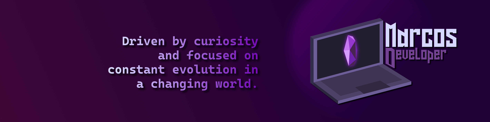
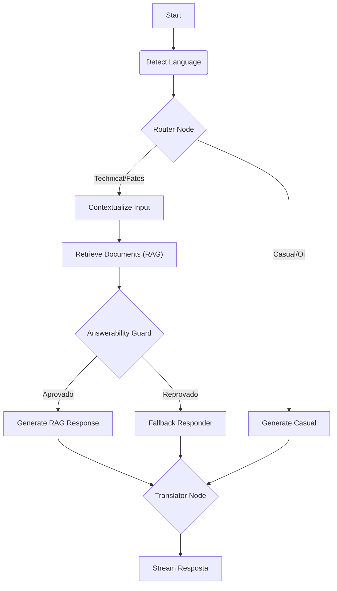

<div align="center">

  
  
  <br>

  
  
  
  

  <br>
  <br>
</div>

> 🔴 **LIVE DEMO:** [marocos.dev](https://marocos.dev/)

Este repositório contém o código-fonte do meu **Portfólio Pessoal**, o mesmo que você acessa no link acima.

Este projeto é **Metalinguístico**: ele é, simultaneamente, o produto final (meu site de apresentação) e um dos principais projetos do portfólio em si. O objetivo aqui não foi apenas "mostrar meus links", mas demonstrar minhas competências em **Engenharia de Software Avançada**, **IA Generativa** e **Design de Alta Fidelidade** na prática.

Ao invés de ler um currículo estático, aqui você conversa com uma **Versão Virtual do Marcos**, alimentada por um sistema RAG (Retrieval Augmented Generation) capaz de responder perguntas sobre minha carreira, stack tecnológica e hobbies.

# Indice

- [Indice](#indice)
- [🧠 O Cérebro: Arquitetura Cognitiva](#-o-cérebro-arquitetura-cognitiva)
  - [🏛️ Por que RAG (Retrieval Augmented Generation)?](#️-por-que-rag-retrieval-augmented-generation)
  - [🧩 Engenharia de Prompt \& Nodes](#-engenharia-de-prompt--nodes)
    - [1. Router Node (O Porteiro)](#1-router-node-o-porteiro)
    - [2. Contextualize Node (A Memória de Curto Prazo)](#2-contextualize-node-a-memória-de-curto-prazo)
    - [3. Generator Node (A Persona)](#3-generator-node-a-persona)
    - [4. Translator Node (Localização)](#4-translator-node-localização)
- [🎨 UX \& Interface Imersiva](#-ux--interface-imersiva)
  - [🖥️ Desktop Metaphor](#️-desktop-metaphor)
  - [⚙️ Controle Total do Usuário](#️-controle-total-do-usuário)
  - [📱 Responsividade \& Performance](#-responsividade--performance)
- [🛠️ Tecnologias Usadas](#️-tecnologias-usadas)
- [📂 Estrutura do Projeto](#-estrutura-do-projeto)
- [🐳 Deploy Profissional (Docker \& VPS)](#-deploy-profissional-docker--vps)
  - [Arquitetura de Microserviços](#arquitetura-de-microserviços)
  - [Deploy no Coolify (Recomendado)](#deploy-no-coolify-recomendado)
  - [Dúvidas, Bugs ou Sugestões?](#dúvidas-bugs-ou-sugestões)
  - [Vamos nos Conectar!](#vamos-nos-conectar)

# 🧠 O Cérebro: Arquitetura Cognitiva

Este projeto não é um simples chatbot. É um **Sistema Agêntico** baseado em grafos (`LangGraph`), projetado para pensar, recuperar memórias e adaptar sua comunicação em tempo real.

### 🏛️ Por que RAG (Retrieval Augmented Generation)?

LLMs (como GPT-4 ou Llama 3) são treinados em dados públicos gerais. Eles **não conhecem** o Marcos Rodrigues, seus projetos privados ou sua trajetória recente. Se perguntados diretamente, eles **alucinariam** (inventariam respostas factualmente incorretas).

**A Solução:**
O RAG atua como um mecanismo de "memória de longo prazo".

1.  **Ingestão:** Lemos arquivos `.md` com a biografia e projetos do Marcos.
2.  **Embedding:** Convertemos esses textos em vetores matemáticos usando `Google Gemini Embeddings` (modelos de alta dimensionalidade).
3.  **Recuperação:** Quando você faz uma pergunta, o sistema busca no banco vetorial (`ChromaDB`) os trechos que possuem maior **similaridade semântica** (menor distância euclidiana) com sua dúvida.
4.  **Geração:** Esses trechos são injetados no prompt do LLM como "Contexto Verdadeiro", forçando-o a responder apenas com base nos fatos fornecidos.

### 🧩 Engenharia de Prompt & Nodes

O fluxo de decisão é governado por nós (Nodes) especializados, cada um com _System Prompts_ meticulosamente calibrados:

#### 1. Router Node (O Porteiro)

- **Função:** Classificar a intenção do usuário para economizar recursos.
- **Prompt Strategy:** Utiliza _Few-Shot Prompting_ (exemplos práticos no prompt) para distinguir entre:
  - `technical`: Perguntas que exigem acesso à memória RAG ("Quais projetos ele fez?", "Sabe React?").
  - `casual`: Conversa fiada ("Oi", "Tudo bem?", "Quem é você?"). Evita queries desnecessárias ao banco de dados.

#### 2. Contextualize Node (A Memória de Curto Prazo)

- **Problema:** Usuários falam de forma elíptica: "Quais projetos ele tem?" -> (Resposta) -> "E quais tecnologias **ele** usa no **último**?"
- **Processamento:** Este nó reescreve a pergunta isolada transformando-a em uma _Query Standalone_ completa ("Quais tecnologias o Marcos usa no projeto NoisePortfolio"), garantindo que a busca no RAG seja precisa mesmo em perguntas vagas.

#### 3. Generator Node (A Persona)

- **Prompt:** Define a personalidade do Chatbot. Não é um robô genérico.
  - **Persona:** Profissional, mas com um toque _cyberpunk/tech_. Direto, humilde, mas confiante.
  - **Regra de Ouro:** "Se a resposta não estiver no contexto fornecido, diga que não sabe. Não invente."

#### 4. Answerability Guard (O Auditor)

- **Função:** Proteção crítica contra alucinações. Antes de gerar qualquer resposta, este nó analisa logicamente se os dados recuperados pelo RAG são **suficientes** para responder a pergunta.
- **Checagens:**
  - **Factualidade:** A resposta está _no texto_ ou exige invenção?
  - **Exaustão:** O usuário está pedindo "mais um" mas o banco de dados já acabou?
- **Resultado:** Se aprovado, libera para o gerador. Se reprovado, desvia para o _Fallback_.

#### 5. Fallback Responder (A "Saída Elegante")

- **Objetivo:** Comunicar negativas de forma carismática e dentro da persona.
- **Smart Fallback:** Ao invés de um erro genérico ("Não sei"), ele adapta a desculpa:
  - "Sobre esse projeto específico, não tenho dados aqui..." (Falta de dados)
  - "Já te contei tudo que eu lembrava sobre isso!" (Exaustão de conteúdo)
  - "Não entendi se você quer saber X ou Y..." (Ambiguidade)

#### 6. Translator Node (Localização)

- **Estratégia:** Todo o raciocínio interno do bot (busca no banco, processamento) ocorre predominantemente na lingua dos dados (geralmente misto ou inglês técnico).
- **Finalização:** Este nó final garante que a resposta entregue ao usuário esteja **sempre** no idioma detectado inicialmente no chat, mantendo a imersão.



---

# 🎨 UX & Interface Imersiva

A interface transcende o conceito tradicional de portfólio, entregando uma **Simulação de Sistema Operacional** no navegador. O objetivo é criar um ambiente digital tátil, familiar e altamente responsivo.

### 🖥️ Desktop Metaphor

- **OS-Like Navigation:** A navegação é ancorada em uma barra de tarefas (Dock) persistente, que centraliza o acesso às seções (Apps), configurações e o "Menu Iniciar".
- **Start Menu (AI Hub):** A interação com o Marcos Virtual não acontece em um chat flutuante genérico, mas sim em um "Live Start Menu". É o núcleo do sistema, onde o usuário busca informações via conversa natural.

### ⚙️ Controle Total do Usuário

O sistema respeita as preferências do visitante com controles acessíveis na barra principal:

- **🌗 Light & Dark Mode:** Temas meticulosamente calibrados. O modo escuro é profundo e elegante, enquanto o modo claro é vibrante e limpo.
- **⏯️ Motion Toggle:** Um controle dedicado para **Pausar Animações**. Ideal para acessibilidade (redução de movimento) ou economia de bateria em dispositivos móveis.
- **🌐 Internacionalização (i18n):** Alternância instantânea entre **Português (BR)** e **Inglês (EN)**, adaptando não apenas a UI, mas também o idioma das respostas da IA.

### 📱 Responsividade & Performance

- **Mobile First:** A metáfora de desktop se adapta fluidamente para mobile, transformando a barra de tarefas em um menu acessível e reorganizando janelas para toque.
- **Feedback Visual:** Respostas da IA via **Server-Sent Events (SSE)** com efeito de digitação ("Typewriter"), e indicadores de status ("Pensando...", "Traduzindo...") para total transparência do processo.

---

# 🛠️ Tecnologias Usadas

<div style="display: inline_block"><br>
  
  
  
  
  
</div>

<br>

- **Frontend:** React, Vite, Framer Motion (Animações), Lucide Icons.
- **Backend:** Python 3.12, FastAPI, Uvicorn.
- **IA:** LangGraph, LangChain, Google Gemini Pro / Groq (Llama 3).
- **Infra:** Docker Compose, Nginx (Reverse Proxy).

---

# 📂 Estrutura do Projeto

```text
NoisePortfolio/
├── 📁 backend/                # O Cérebro (API & IA)
│   ├── 📂 app/
│   │   ├── 📂 api/            # Rotas (SSE, Chat)
│   │   ├── 📂 core/           # Configs, Logger, RateLimit
│   │   ├── 📂 graph/          # 🧠 Lógica do LangGraph (Nodes, State)
│   │   └── 📂 services/       # RAG Service (ChromaDB)
│   ├── 📂 data/               # Arquivos de conhecimento (.md)
│   ├── boot.py                # Script de Inicialização Inteligente
│   ├── ingest.py              # Script de Ingestão de Dados
│   └── docker-compose.yml     # Orquestração
│
├── 📁 frontend/               # A Face (React)
│   ├── 📂 src/
│   │   ├── 📂 components/     # UI (StartMenu, ChatBox)
│   │   ├── 📂 contexts/       # i18n, Theme
│   │   └── 📂 hooks/          # Logica customizada
│   └── index.html
```

---

# 🐳 Deploy Profissional (Docker & VPS)

Este projeto foi otimizado para deploy em serviços como **Coolify**, Railway ou AWS, utilizando containers Docker auto-gerenciáveis.

## Arquitetura de Microserviços

O Backend roda isolado em um container Python. Ele possui um script inteligente (`boot.py`) que detecta se é a primeira execução:

- **Primeiro Deploy:** Detecta banco vazio -> Roda Ingestão -> Inicia API.
- **Reinícios:** Detecta banco existente -> Pula Ingestão (Economia de API) -> Inicia API.
- **Update de Conteúdo:** É gerenciado via **GitOps**. Commite as alterações em `data/profile.md` e o Coolify atualiza a imagem.

## Deploy no Coolify (Recomendado)

1.  **Crie um Serviço:** Selecione "Docker Compose" ou aponte seu repositório Git.
2.  **Variáveis de Ambiente:** No painel do Coolify, adicione:
    - `GOOGLE_API_KEY`
    - `GROQ_API_KEY`
    - `LLM_PROVIDER=groq`
    - `FORCE_REINGEST=false` (Mude para `true` **apenas** quando quiser forçar a recriação do banco de dados após editar o `profile.md`).
3.  **Deploy:** O `docker-compose.yml` já está configurado para usar **Volumes Nomeados** (`chroma_data`), garantindo que a memória da IA não seja perdida entre deploys.

```yaml
# Exemplo de persistência no docker-compose.yml
volumes:
  chroma_data: # O Docker gerencia isso no disco da VPS
```

---

## Dúvidas, Bugs ou Sugestões?

Se você encontrar algum _bug_, notar a falta de alguma feature essencial (como um campo específico no financeiro, uma métrica de saúde, etc.) ou tiver sugestões de melhoria, **eu quero saber!** Como não sou especialista em contabilidade ou administração, o feedback da comunidade é vital para tornar o Bússola mais robusto para todos.

A melhor forma de contribuir é **abrindo uma Issue** diretamente no repositório do **GitHub**. Isso ajuda a manter tudo organizado e visível.

- **[➡️ Abrir uma Issue no GitHub](https://github.com/Marocosz/Marocos-AI/issues)**

---

## Vamos nos Conectar!

Adoraria ouvir seu _feedback_ e me conectar com outros desenvolvedores e entusiastas de tecnologia. Você pode me encontrar nas seguintes plataformas:

- **Desenvolvido por:** `Marcos Rodrigues`
- 💼 **LinkedIn:** [https://www.linkedin.com/in/marcosrodriguesptc](https://www.linkedin.com/in/marcosrodriguesptc/)
- 🐙 **GitHub:** [https://github.com/Marocosz](https://github.com/Marocosz)
- 📧 **Email:** `marcosrodriguesepro@gmail.com`

Sinta-se à vontade para se conectar!
