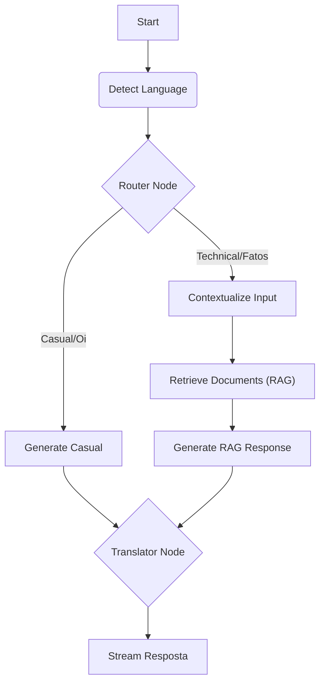

<div align="center">

  
  
  <br>

  
  
  
  

  <br>
  <br>
</div>

---

O **Portfolio** não é apenas um site estático; é uma **experiência digital viva**. Projetado para quebrar a barreira entre o visitante e o desenvolvedor, ele utiliza **Inteligência Artificial Generativa (RAG)** para permitir que recrutadores e visitantes conversem diretamente com uma versão virtual do Marcos Rodrigues.

# Indice

- [Indice](#indice)
- [🧠 O Cérebro (Arquitetura de IA)](#-o-cérebro-arquitetura-de-ia)
  - [Fluxo de Pensamento (LangGraph)](#fluxo-de-pensamento-langgraph)
  - [RAG (Retrieval Augmented Generation)](#rag-retrieval-augmented-generation)
- [🎨 UX \& Design System](#-ux--design-system)
- [🛠️ Tecnologias Usadas](#️-tecnologias-usadas)
- [📂 Estrutura do Projeto](#-estrutura-do-projeto)
- [🚀 Como Rodar Localmente](#-como-rodar-localmente)
  - [Pré-requisitos](#pré-requisitos)
  - [Backend](#backend)
  - [Frontend](#frontend)
- [🐳 Deploy Profissional (Docker \& VPS)](#-deploy-profissional-docker--vps)
  - [Arquitetura de Microserviços](#arquitetura-de-microserviços)
  - [Deploy no Coolify (Recomendado)](#deploy-no-coolify-recomendado)
- [🤝 Contato](#-contato)

# 🧠 O Cérebro (Arquitetura de IA)

O diferencial deste projeto é o uso de **Agentes de IA Stateful** (com memória e estado) gerenciados pelo `LangGraph`. Não é apenas um wrapper de API da OpenAI; é um fluxo de decisão complexo.

## Fluxo de Pensamento (LangGraph)

Cada mensagem do usuário passa por uma "cadeia de pensamento" antes de ser respondida. O sistema decide dinamicamente se precisa consultar a memória (Currículo) ou se pode apenas socializar.



1.  **Router Inteligente:** Classifica a intenção. Perguntas sobre "Banda favorita" ou "Stacks" vão para a rota técnica. Um simples "Oi" vai para a rota casual (economizando tokens e tempo).
2.  **Memória Contextual:** O sistema lembra do que foi dito anteriormente na conversa, permitindo diálogos fluidos ("E sobre o React?" -> entende que "E" se refere ao contexto anterior).
3.  **Tradução Automática:** Se o usuário falar Inglês, o bot processa em Português (para manter a persona) e um nó final traduz a resposta perfeitamente antes de entregar.

## RAG (Retrieval Augmented Generation)

O conhecimento do bot não é alucinado. Ele é fundamentado em dados reais ingeridos a partir de arquivos Markdown (`profile.md`, `projects.md`).

- **Database:** ChromaDB (Vetorial).
- **Embeddings:** Google Gemini Embeddings (Alta performance semântica).
- **Ingestão Inteligente:** Script `boot.py` que verifica e atualiza a memória automaticamente no deploy.

---

# 🎨 UX & Design System

A interface segue uma estética **"Clean Noise"**, misturando minimalismo funcional com texturas granuladas e tipografia experimental.

- **Start Menu Interativo:** A chatbox não é um modal flutuante genérico; ela simula um Menu Iniciar de um sistema operacional, criando familiaridade.
- **Streaming Real-Time (SSE):** As respostas da IA chegam via _Server-Sent Events_, com efeito de digitação ("Typewriter effect"), dando a sensação de que o bot está "pensando" e escrevendo ao vivo.
- **Feedback Visual:** Indicadores de estado ("Pesquisando nas memórias...", "Traduzindo...") mantêm o usuário informado sobre o processo mental da IA.

---

# 🛠️ Tecnologias Usadas

<div style="display: inline_block"><br>
  
  
  
  
  
</div>

<br>

- **Frontend:** React, Vite, Framer Motion (Animações), Lucide Icons.
- **Backend:** Python 3.12, FastAPI, Uvicorn.
- **IA:** LangGraph, LangChain, Google Gemini Pro / Groq (Llama 3).
- **Infra:** Docker Compose, Nginx (Reverse Proxy).

---

# 📂 Estrutura do Projeto

```text
NoisePortfolio/
├── 📁 backend/                # O Cérebro (API & IA)
│   ├── 📂 app/
│   │   ├── 📂 api/            # Rotas (SSE, Chat)
│   │   ├── 📂 core/           # Configs, Logger, RateLimit
│   │   ├── 📂 graph/          # 🧠 Lógica do LangGraph (Nodes, State)
│   │   └── 📂 services/       # RAG Service (ChromaDB)
│   ├── 📂 data/               # Arquivos de conhecimento (.md)
│   ├── boot.py                # Script de Inicialização Inteligente
│   ├── ingest.py              # Script de Ingestão de Dados
│   └── docker-compose.yml     # Orquestração
│
├── 📁 frontend/               # A Face (React)
│   ├── 📂 src/
│   │   ├── 📂 components/     # UI (StartMenu, ChatBox)
│   │   ├── 📂 contexts/       # i18n, Theme
│   │   └── 📂 hooks/          # Logica customizada
│   └── index.html
```

---

# 🚀 Como Rodar Localmente

### Pré-requisitos

- Node.js 18+
- Python 3.11+
- Chave de API (`GOOGLE_API_KEY` ou `GROQ_API_KEY`).

### Backend

1.  Entre na pasta:
    ```bash
    cd backend
    ```
2.  Crie o ambiente virtual e instale dependências:
    ```bash
    python -m venv venv
    source venv/bin/activate  # Linux/Mac
    .\venv\Scripts\activate   # Windows
    pip install -r requirements.txt
    ```
3.  Crie um arquivo `.env` com suas chaves:
    ```env
    LLM_PROVIDER=groq
    GROQ_API_KEY=sua_chave_aqui
    GOOGLE_API_KEY=sua_chave_aqui  # Necessário para Embeddings
    ```
4.  Rode a ingestão (cria a memória) e o servidor:
    ```bash
    python ingest.py  # Cria o banco ChromaDB local
    python main.py    # Roda a API na porta 8000
    ```

### Frontend

1.  Em outro terminal, entre na pasta:
    ```bash
    cd frontend
    ```
2.  Instale e rode:
    ```bash
    npm install
    npm run dev
    ```
3.  Acesse: `http://localhost:5173`

---

# 🐳 Deploy Profissional (Docker & VPS)

Este projeto foi otimizado para deploy em serviços como **Coolify**, Railway ou AWS, utilizando containers Docker auto-gerenciáveis.

## Arquitetura de Microserviços

O Backend roda isolado em um container Python. Ele possui um script inteligente (`boot.py`) que detecta se é a primeira execução:

- **Primeiro Deploy:** Detecta banco vazio -> Roda Ingestão -> Inicia API.
- **Reinícios:** Detecta banco existente -> Pula Ingestão (Economia de API) -> Inicia API.
- **Update de Conteúdo:** É gerenciado via **GitOps**. Commite as alterações em `data/profile.md` e o Coolify atualiza a imagem.

## Deploy no Coolify (Recomendado)

1.  **Crie um Serviço:** Selecione "Docker Compose" ou aponte seu repositório Git.
2.  **Variáveis de Ambiente:** No painel do Coolify, adicione:
    - `GOOGLE_API_KEY`
    - `GROQ_API_KEY`
    - `LLM_PROVIDER=groq`
    - `FORCE_REINGEST=false` (Mude para `true` **apenas** quando quiser forçar a recriação do banco de dados após editar o `profile.md`).
3.  **Deploy:** O `docker-compose.yml` já está configurado para usar **Volumes Nomeados** (`chroma_data`), garantindo que a memória da IA não seja perdida entre deploys.

```yaml
# Exemplo de persistência no docker-compose.yml
volumes:
  chroma_data: # O Docker gerencia isso no disco da VPS
```

---

# 🤝 Contato

Projeto desenvolvido com foco em **UX de Alta Fidelidade** e **Engenharia de Prompt**.

- 🐙 **GitHub:** [Marocosz](https://github.com/Marocosz)
- 💼 **LinkedIn:** [Marcos Rodrigues](https://linkedin.com/in/marcosrodriguesptc)

---

<div align="center">
  <sub>Built with 💜 and lots of ☕ by Marcos.</sub>
</div>
